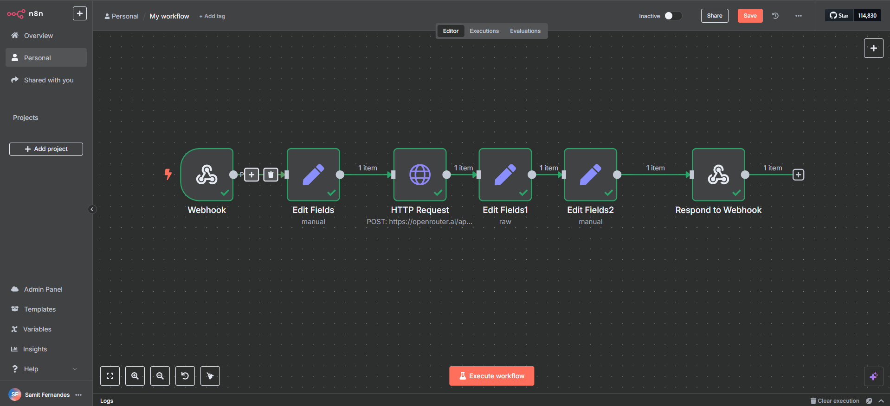
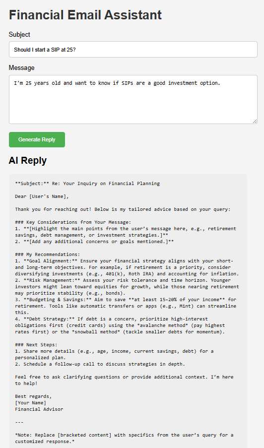

# AI Financial Email Assistant (n8n + OpenRouter)

A no-code automation project that uses **n8n** and **OpenRouter's DeepSeek R1** model to generate personalized financial advisory email responses in real-time.

## Features
- Webhook-powered message intake
- Dynamic prompt generation from user input
- LLM integration with OpenRouter API (DeepSeek R1)
- Auto-formatted, markdown-friendly financial advice
- Frontend in simple HTML + JS to test responses

## Tech Stack
- n8n (workflow automation)
- OpenRouter API (LLM)
- DeepSeek R1
- HTML/CSS/JavaScript
- Prompt engineering

## How It Works
1. User submits a query via a form
2. n8n receives input, builds a prompt
3. Sends prompt to DeepSeek via OpenRouter API
4. Response is returned and displayed

## Example Query

```json
{
  "subject": "How should I plan for retirement?",
  "body": "I'm 30, make ₹12L/year, and want to retire by 55. How much should I invest and in what?"
}
```
## Screenshots

### n8n Workflow Preview  
The entire workflow built in n8n using webhook, Set, HTTP Request, and Respond nodes:



### AI-Generated Email Reply  
A polished, markdown-formatted financial advisory response generated by DeepSeek R1 based on user input:

<p align="center">
  
</p>
